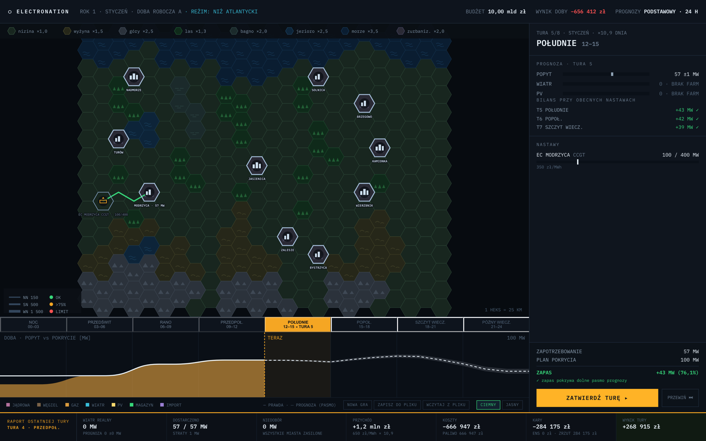

# ElectroNation

Turowa gra o prowadzeniu krajowej sieci elektroenergetycznej. Grasz operatora
systemu: stawiasz elektrownie i linie na mapie heksów, a potem godzina po
godzinie domykasz bilans mocy — mając do dyspozycji wyłącznie prognozy, które
nigdy nie są dokładne.

**▶ [Zagraj w przeglądarce](https://tomasz-marchewka.github.io/ElectroNation/)**



## O co chodzi

- **Doba = 8 tur po 3 h**, 3 doby reprezentatywne na miesiąc, 36 dób na rok.
- **Sieć jak woda w rurach**: linie i stacje mają twarde limity MW, straty rosną
  z długością. Bez Kirchhoffa i bez częstotliwości — rozpływ liczy
  deterministyczny min-cost flow.
- **Prawda vs prognoza**: pogoda i popyt są losowane na starcie doby, a Ty
  widzisz tylko ich zaszumiony obraz w paśmie błędu. Ulepszenia systemu prognoz
  zwężają pasmo.
- **Kary za niedobór i zrzut** — brak twardego przegranego, ale budżet pamięta
  każdą nieprzygotowaną szczytówkę.
- Wszystkie nastawy są ręczne. Nie ma przycisku „zoptymalizuj za mnie”.

## Uruchomienie lokalnie

```bash
npm ci && npm run dev
```

Testy i kontrola jakości:

```bash
npm test && npm run lint && npm run typecheck
```

## Struktura

| Katalog     | Zawartość                                                    |
| ----------- | ------------------------------------------------------------ |
| `docs/`     | Dokumenty projektowe — źródło prawdy dla mechaniki i parametrów |
| `src/engine/` | Czysta symulacja (bez DOM, deterministyczna, seedowany PRNG) |
| `src/app/`  | UI dyspozytora w React + SVG                                 |
| `tests/`    | Testy spec / właściwościowe / golden / komponentów / e2e     |
| `prototyp/` | Jednorazowy prototyp, do wyrzucenia                          |

Start lektury: [docs/01-mechanika-gry.md](docs/01-mechanika-gry.md) (§11 —
decyzje i pytania otwarte).

## Stos

TypeScript (strict) · Vite · React 19 · Zustand · Vitest · Playwright.
Bez backendu — statyczny deploy na GitHub Pages przy każdym pushu na `main`.
